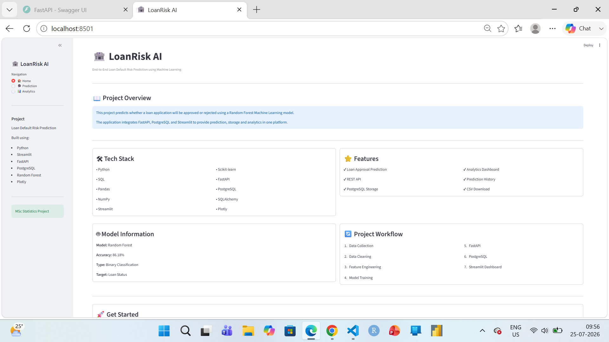
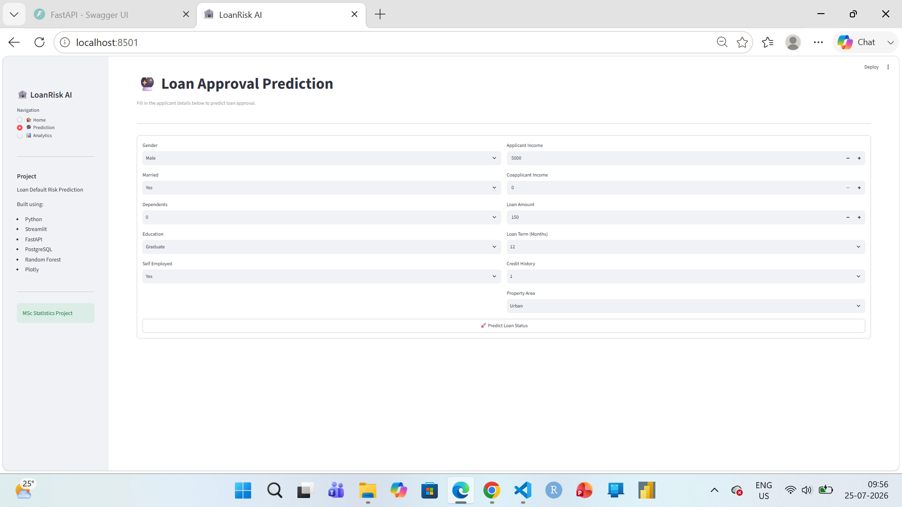
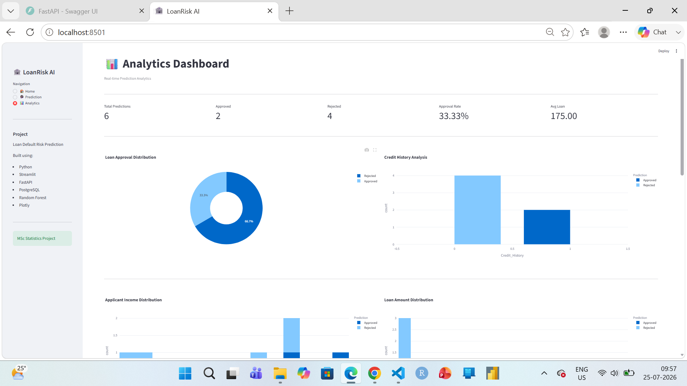
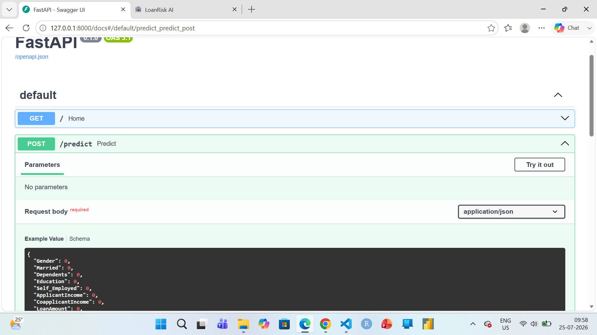

# 🏦 LoanRisk AI

An end-to-end Machine Learning application that predicts whether a loan application is likely to be approved or rejected using a Random Forest classifier.

The project integrates Machine Learning, FastAPI, PostgreSQL, and Streamlit to provide real-time predictions, prediction history, and an interactive analytics dashboard.

---

## 🚀 Features

- Loan Approval Prediction
- FastAPI REST API
- PostgreSQL Database Integration
- Interactive Streamlit Dashboard
- Prediction History Storage
- Analytics Dashboard
- Download Prediction History (CSV)
- Responsive User Interface

---

## 🛠️ Tech Stack

### Programming Language
- Python
- SQL

### Machine Learning
- Scikit-learn
- Pandas
- NumPy
- Joblib

### Backend
- FastAPI
- Uvicorn

### Database
- PostgreSQL
- SQLAlchemy

### Frontend
- Streamlit
- Plotly

---

## 🤖 Machine Learning Model

- Algorithm: Random Forest Classifier
- Problem Type: Binary Classification
- Target Variable: Loan Status
- Model Accuracy: **86.18%**

---

## 📂 Project Structure

```text
Loan_Default_Risk_Prediction/
│
├── api/
│   ├── crud.py
│   ├── database.py
│   ├── main.py
│   └── models.py
│
├── data/
│
├── models/
│   ├── feature_names.pkl
│   └── loan_model.pkl
│
├── notebooks/
│
├── reports/
│
├── src/
│
├── views/
│   ├── analytics.py
│   ├── home.py
│   └── prediction.py
│
├── app.py
├── requirements.txt
├── README.md
└── .gitignore
```

---

## ⚙️ Workflow

```
Dataset
      ↓
Data Preprocessing
      ↓
Feature Engineering
      ↓
Random Forest Model
      ↓
FastAPI REST API
      ↓
PostgreSQL Database
      ↓
Streamlit Dashboard
```

---

## 📊 Dashboard Modules

### 🏠 Home
- Project Overview
- Tech Stack
- Features
- Model Information
- Workflow

### 🔮 Prediction
- Applicant Details Form
- Loan Approval Prediction
- Prediction Confidence
- Applicant Summary

### 📈 Analytics
- KPI Cards
- Approval vs Rejection
- Credit History Analysis
- Income Distribution
- Loan Amount Distribution
- Prediction History
- CSV Download

---

## ▶️ Installation

### Clone Repository

```bash
git clone https://github.com/<Vaishnavi-28481>/Loan-Default-Risk-Prediction.git
```

### Create Virtual Environment

```bash
python -m venv .venv
```

### Activate Virtual Environment

#### Windows

```bash
.venv\Scripts\activate
```

### Install Dependencies

```bash
pip install -r requirements.txt
```

---

## ▶️ Run FastAPI

```bash
uvicorn api.main:app --reload
```

API Documentation:

```
http://127.0.0.1:8000/docs
```

---

## ▶️ Run Streamlit

```bash
streamlit run app.py
```

---

## 📸 Screenshots

- Home Dashboard

- Prediction Page

- Analytics Dashboard

- FastAPI Swagger UI



---

## 🔮 Future Enhancements

- Cloud Deployment
- User Authentication
- Model Monitoring
- Email Prediction Reports
- Docker Support
- CI/CD Pipeline

---

## 👩‍💻 Author

**Vaishnavi Metkar**

M.Sc. Statistics

Python | Machine Learning | SQL | FastAPI | PostgreSQL | Streamlit